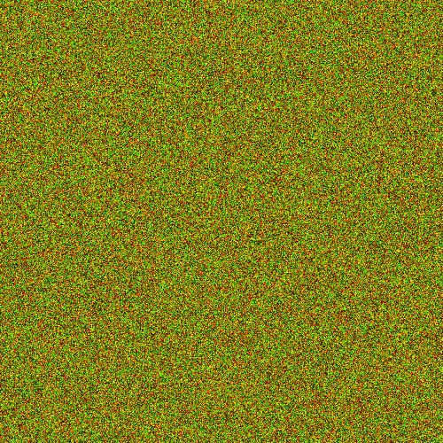

You've recently heard rumors that Mr Hurley is an undercover spy from North Korea. Last week you intercepted a message he sent back North Korean intelligence. The message appears to be hidden inside a scrambled image. Time to break out your programming skills and see what he's up to! Here's the image you intercepted:

The image appears to just be random noise, but you're confident there's a hidden message in it. Your goal is to write a program that will look at each invididual pixel of the original image, and use the values to generate a new image. 

Here is an example project that you can import into intellij or eclipse that will have some code to help you get started.

[Example Project](SecretChallenge1.zip)

To import the project into BlueJ click Project -> Open ZIP/JAR and select the zip file you downloaded. It should open the project, the Main.java file is the only file you need to check.

Hint: Look at the filename of the scrambled image. Also, your output image should be a single color background with text written in the center.
