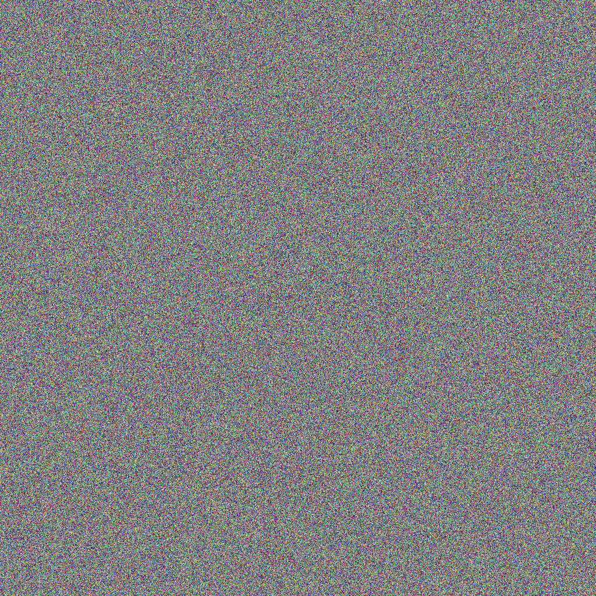
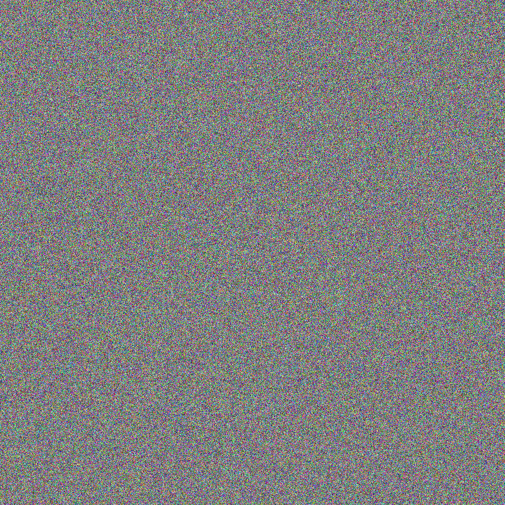

Mr Hurley has heard that his previous message encoding was broken. This time he's got some help from a fellow spy. Your job is to find the secret passcode.

# Part 1

You've discovered 2 images that Mr Hurley sent to North Korean intelligence this time. They both look like gibberish, but you've got a feeling they're related.

This reminds you of a technique used for backing up data. A simple way to backup data is to just make a copy of it. So if you have 1GB of important data that needs to be backed up, you need a total of 2GB to store the original and the copy. However, you can do a little better by using the bitwise XOR operator.

| a | b | a XOR b |
| - | - | :-----: |
| 0 | 0 |    0    |
| 0 | 1 |    1    |
| 1 | 0 |    1    |
| 1 | 1 |    0    |

This operator can be used to make backups smaller. For example, let's look at backing up 2 single bits. The naive method mentioned above would require 4 bits (1 bit for the original `a`, 1 bit for the original `b`, 1 bit for the copy of `a`, and 1 bit for the copy of `b`). But using XOR, we can safely store the data using just 3 bits (1 bit for the original `a`, 1 bit for the original of `b`, and 1 bit for `a XOR b`). Now in the event that we lose the original copy of `a`, we can look at the original copy of `b` and the backup data of `a XOR b` to compute the original value of a using the table above (Or using the `^` operator in java). Can you use the XOR operator on the pixels of the 2 scrambled images to compute the original image Mr Hurley sent?

[Example Project](ImageChallenge2.zip)

# Part 2

